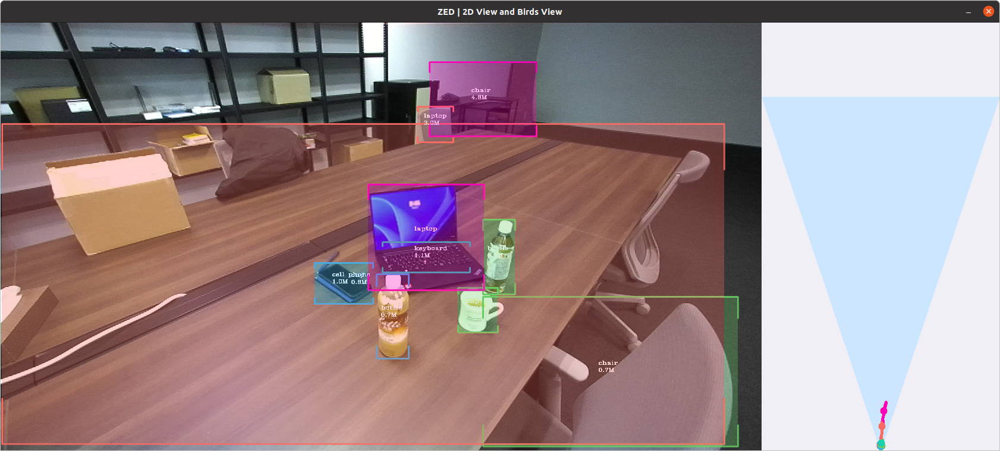

# yolox-zed-sdk
docker environment for YOLOX on Jetson AGX Orin with ZED SDK

- Pytorchを含むJetson 用のDockerImage を用いて、 ZED SDK を利用できる環境を提供する。
- ZED SDK によるデータ取得を用いて、その環境内でyoloxによる物体検出を実行する。

## requirement
- StereoLabs ZED2i camera
- NVIDIA Jetson AGX Orin
- docker

### docker
docker の外の環境で`xhost +`を実行しておきます。

```
$ bash docker_build.sh
$ bash docker_run.sh
# cd /root/yolox-zed-sdk
# make prepare
# cd tools
# bash webcam_zed.sh
```

### toolsにあるスクリプト
- tools/webcam_as_usb.sh　# ZED2iをUSBカメラとして使用する検出スクリプト
- tools/webcam_zed.sh  # ZED2iをZED SDKの枠組みで使用する検出スクリプト
- tools/demo_zed.py 　ZEDカメラを用いたyolox での物体検出(検出結果をZED SDKに戻して３D表示させようとしている。)
上記のスクリプトのうち、tools/demo_zed.pyがopenglでの3D表示付きで表示できれば、このリポジトリでの目的は達成である。

- tensorRT化したモデルでの物体検出の推論は10ms前後。
- tensorRT化前は30ms前後。

#### 利用例
bash webcam_as_usb.sh

bash webcam_zed.sh 


### tools/demo_zed.py の使い方

```
root@orin:~/yolox-zed-sdk/tools# python3 demo_zed.py -h
usage: YOLOX Demo! [-h] [-expn EXPERIMENT_NAME] [-n NAME] [--path PATH] [--camid CAMID]
                   [--save_result] [-f EXP_FILE] [-c CKPT] [--device DEVICE] [--conf CONF]
                   [--nms NMS] [--tsize TSIZE] [--fp16] [--legacy] [--fuse] [--trt] [--as_USB]
                   demo

positional arguments:
  demo                  demo type, eg. image, video and webcam

optional arguments:
  -h, --help            show this help message and exit
  -expn EXPERIMENT_NAME, --experiment-name EXPERIMENT_NAME
  -n NAME, --name NAME  model name
  --path PATH           path to images or video
  --camid CAMID         webcam demo camera id
  --save_result         whether to save the inference result of image/video
  -f EXP_FILE, --exp_file EXP_FILE
                        please input your experiment description file
  -c CKPT, --ckpt CKPT  ckpt for eval
  --device DEVICE       device to run our model, can either be cpu or gpu
  --conf CONF           test conf
  --nms NMS             test nms threshold
  --tsize TSIZE         test img size
  --fp16                Adopting mix precision evaluating.
  --legacy              To be compatible with older versions
  --fuse                Fuse conv and bn for testing.
  --trt                 Using TensorRT model for testing.
  --as_USB              camera as USB Camera

root@orin:~/YOLOX#

```
### errorを再現する状況
- 次に
tools/demo_zed.py を改変すると
```
-    view_gl = False
+    view_gl = True
```
以下のエラーを生じてしまう。
 ERROR: Internal error <FBConfig with necessary capabilities not found> in function fgOpenWindow

- エラーの解決策をまだ見つけられていない。


host環境のOpenGL
- PyOpenGL 3.1.7
- PyOpenGL-accelerate 3.1.7

## TensorRT対応
### 情報源
  - YOLOX の公式サイトによるTensorRT化のdeploy 方法
  https://github.com/Megvii-BaseDetection/YOLOX/tree/main/demo/TensorRT/python

  https://yolox.readthedocs.io/en/latest/demo/trt_py_readme.html
### TensortRTの利用のための準備
- prepare.sh が実施すること。
  torcht2trt のインストール
  指定したtrtモデルへの変換。

Docker 環境内：
```
cd /root/YOLOX/yolox-docker_run
bash prepare.sh

```
### 変換作業
```
# python3 tools/trt.py -n <YOLOX_MODEL_NAME> -c <YOLOX_CHECKPOINT>

# python3 tools/trt.py -n yolox-s -c yolox_s.pth
2024-01-24 03:28:15.999 | INFO     | __main__:main:71 - Converted TensorRT model done.
2024-01-24 03:28:16.051 | INFO     | __main__:main:79 - Converted TensorRT model engine file is saved for C++ inference.

## TensorRTに変換済みのファイルが置かれる場所
root@orin:~/YOLOX# ls -lF YOLOX_outputs/yolox_s/
total 48932
-rw-r--r-- 1 root root 20431374 Jan 24 03:28 model_trt.engine
-rw-r--r-- 1 root root 29663539 Jan 24 03:28 model_trt.pth
drwxr-xr-x 3 root root     4096 Jan 24 04:20 vis_res/
```
#### Docker 環境でのTRT化したモデルをDocker環境外に保存する方法
- docker_run.sh の中で設定するvolume のマウントポイントにYOLOX_outputs/を追加した。
  - このことで、各実行時のYOLOX_outputs/ディレクトリを永続化した。

### Docker環境で利用したZED SDK のインストーラー
https://download.stereolabs.com/zedsdk/4.1/l4t35.3/jetsons
で入手できます。
入手の手順、インストール手順はDockerfile に記述してあります。
## SEE ALSO
[Jetson Xavier AGXでYOLOXを動かす　ちょっとだけベンチマーク](https://qiita.com/sowd0726/items/bd916f712946961a7432)

